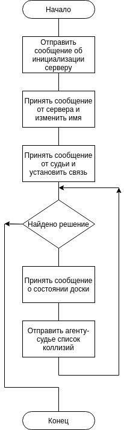

# N Figures Judge

Агент-судья - это программа, 
цель которой после каждого обновления позиций фигур 
на доске собрать данные о коллизиях от всех агентов-фигур,
а затем выбрать и отправить на сервер фигуру, которую следует
передвинуть на заранее выбранное место (в зависимости от стратегии).
К серверу может подключиться только один агент-судья.

Блок-схема алгоритма работы агента-судьи представлена на рисунке

